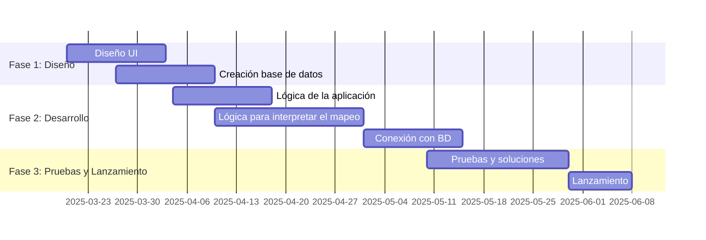
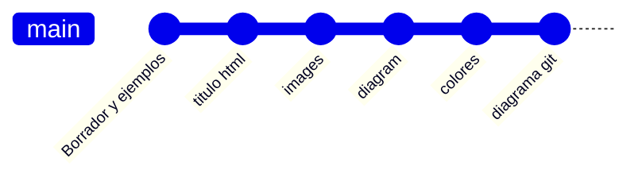
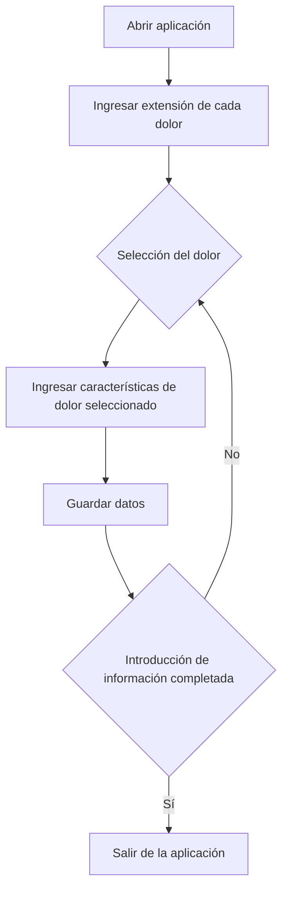
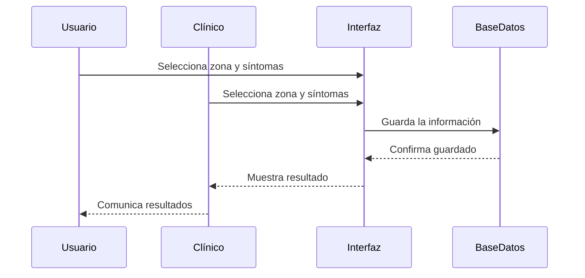
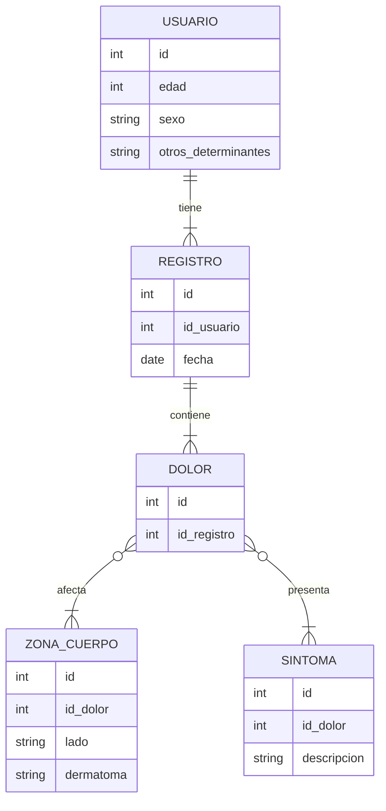
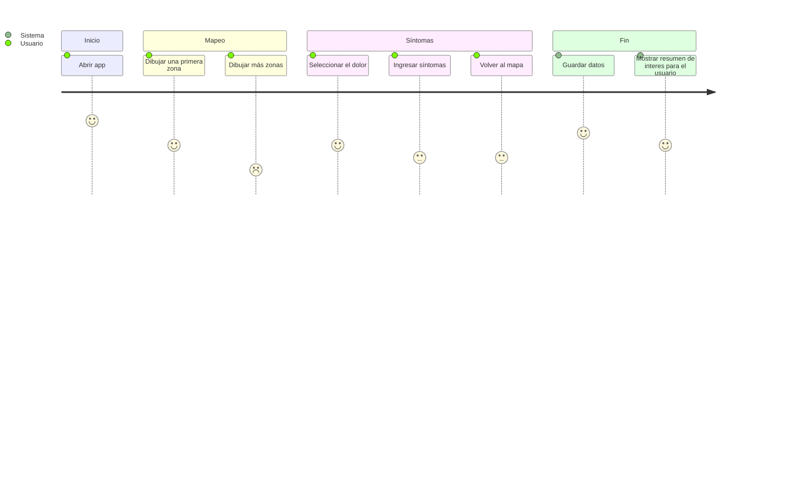
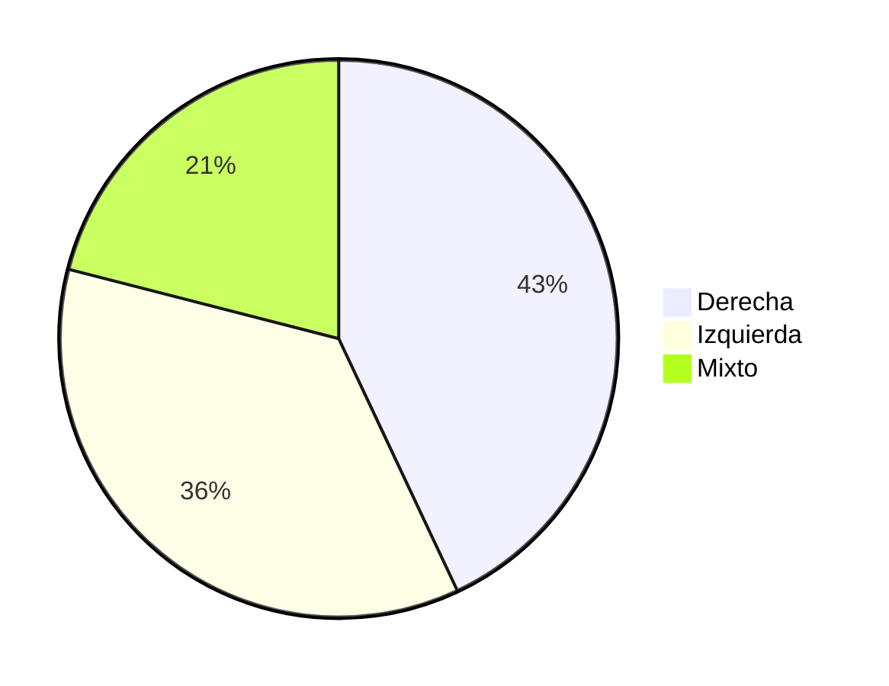

# Proyecto Final de Grado DAM:
  
# 

 Desarrollo de una aplicación móvil para la cuantificación del dolor crónico

## Resumen :clipboard:
**Objetivos**: Desarrollar una aplicación móvil para la cuantificación del dolor en pacientes con dolor crónico que permita su mapeo corporal y caracterización.

**Tareas**:
- Desarrollo de una interfaz gráfica que permita a entrevistadores clínicos y pacientes describir la extensión y características de dolor crónico que padecen.
- Desarrollo de una base de datos que permita recoger la información aportada por los usuarios, e información calculada como porcentaje de superficie corporal afectada, lateralidad del dolor, y afectación por dermatomas.
- Comunicación e integración de la interfaz con la lógica y la base de datos.

**Recursos**:
- Ordenador con un sistema operativo con un entorno de escritorio gráfico (Windows).
- Android Studio para el desarrollo de la interfaz, la lógica y su integración, incluyendo las librerías y paquetes necesarios.
- Kotlin como lenguaje de programación
- Posible uso de bases de datos relacionales o de bases de datos NoSQL.
- Tablet Android para la ejecución de la aplicación creada.

Este proyecto se vincula con Unizar Universa y se engloba en investigaciones acerca del dolor crónico.

  

## Introducción :question:
El dolor crónico se define como aquel dolor cuya duración es mayr a 3 meses. Según el "Barómetro del dolor crónico en España 2022"[[1]-[2]], un 25,9% de las personas encuestadas padecen dolor persistente, afectando especialmente a mujeres y a personas mayores de 55 años. Además, más de la mitad de las personas que sufren dolor crónico lo clasifican de intensidad elevada o insoportable.

En la siguiente tabla se muestran las características del dolor crónico entre la población encuentada[1].
| Variables | Categorías | % |
|-----------|------------|---| 
| N=1.825 |
| Prevalencia | Sin dolor | 66,4 |
| | Dolor Continuo | 7,7 |
| | Dolor Crónico  |25,9 |
| Duración del dolor crónico en años | Media(DT) | 6,83 (8,41) |
| Causa diagnóstica del DC (puede haber más de una) | Artrosis | 33 |
| | Osteoporosis | 32,9 |
| | Dolor cervical | 46,2 |
| | Dolor lumbar | 58,1 |
| | Traumatismo | 14,5 |
| | Migraña y otros dolores de cabeza crónicos | 31,5 | 
| | Dolor relacionado intervención quirúrgica | 15,1 |
| | Artritis reumatoide | 18,1 |
| | Ciática | 25,6 |
| | Contracturas musculares | 50,6 |
| | Cáncer | 3,6 | 
| | Hombro | 29,2 |
| | Fibromialgia | 10,4 | 
| | Neuropatía diabética u otras neuropatías | 7,7 |
| | Síndrome del túnel carpiano | 12,2 | 
| | Enfermedad de Crohn o colitis ulcerosa | 4,1 | 
| | Hernia discal | 1,2 | 
| | Dismenorrea/ endometriosis | 1 |
| | Desconoce la causa patológica | 27,1 | 
| | Otras | 5,9 |
| Donde se localiza el dolor que más afecta | Es un dolor generalizado | 13,2 |
| | Cabeza |9,1 |
| | Cuello (cervicales) | 10,6 |
| | Espalda | 28 |
| | Extremidades y/o articulaciones | 33,1 |
| | Pecho | 1 |
| | Abdomen | 4 |
| | Otro | 1,1 |
| Trastorno del sueño debido al DC | 64,8 |
| Intensidad del Dolor | Muy poco o poco (1-3)|
| | Moderado (4-6) |
| | Mucho (7-9) 
| | Insoportable (10) 
| | Media (DT) 
85 
608 
1.051 
81 
6,78 (1,72) 
4,7 
33,3 
57,6 
4,4 
Intensidad del Dolor por grupos de edad 18-34 
35-54 
55-75 
76-85 
300 
719 
639 
167 
6,66 (1,58) 
6,95 (1,63) 
6,89 (1,65) 
5,85 (2,21) 
Causas del dolor de individuos con intensidad de 
dolor moderado (N=608) 
Artrosis Sí 
No 
176 
432 
28,9 
71,1 
Osteoporosis Sí 
No 
175 
433 
28,8 
71,2 
Dolor cervical Sí 
No 
241 
367 
39,6 
60,4 
Dolor lumbar Sí 
No 
332 
276 
54,6 
45,4 
Traumatismo Sí 
No 
77 
531 
12,7 
87,3 
Migraña y otros dolores de cabeza crónicos Sí 
No 
153 
455 
25,2 
74,8 
Dolor relacionado intervención quirúrgica Sí 
No 
77 
531 
12,7 
87,3 
Artritis reumatoide Sí 
No 
83 
525 
13,7 
86,3 
Ciática Sí 
No 
119 
489 
19,6 
80,4 
Contracturas musculares Sí 
No 
270 
338 
44,4 
55,6 
Cáncer Sí 
No 
18 
590 
3,0 
97,0 
Hombro Sí 
No 
139 
469 
22,9 
77,1 
Fibromialgia Sí 
No 
29 
579 
4,8 
95,2 
Neuropatía diabética u otras neuropatías Sí 
No 
42 
566 
6,9 
93,1 
Síndrome del túnel carpiano Sí 
No 
53 
555 
8,7 
91,3 
Enfermedad de Crohn o colitis ulcerosa Sí 
No 
23 
585 
3,8 
96,2 
Hernia discal Sí 
No 
2 
606 
0,3 
99,7 
Dismenorrea/ endometriosis Sí 
No 
2 
606 
0,3 
99,7 
Desconoce la causa patológica Sí 
No 
175 
433 
28,8 
71,2 
Causas del dolor de individuos con intensidad de 
dolor mucha (N=1051) 
Artrosis Sí 
No 
366 
685 
34,8 
65,2 
Osteoporosis Sí 
No 
365 
686 
34,7 
65,3 
Dolor cervical Sí 
No 
529 
522 
50,3 
49,7 
Dolor lumbar Sí 
No 
642 
409 
61,1 
38,9 
Traumatismo Sí 
No 
157 
894 
14,9 
85,1 
Migraña y otros dolores de cabeza crónicos Sí 
No 
359 
692 
34,2 
65,8 
Dolor relacionado intervención quirúrgica Sí 
No 
166 
885 
15,8 
84,2 
Artritis reumatoide Sí 
No 
206 
845 
19,6 
80,4 
Ciática Sí 
No 
304 
747 
28,9 
71,1 
Contracturas musculares Sí 
No 
570 
481 
54,2 
45,8 
Cáncer Sí 
No 
42 
1009 
4,0 
96,0 
Hombro Sí 
No 
334 
717 
31,8 
68,2 
Fibromialgia Sí 
No 
137 
914 
13,0 
87,0 
Neuropatía diabética u otras neuropatías Sí 
No 
81 
970 
7,7 
92,3 
Síndrome del túnel carpiano Sí 
No 
155 
896 
14,7 
85,3 
Enfermedad de Crohn o colitis ulcerosa Sí 
No 
44 
1007 
4,2 
95,8 
Hernia discal Sí 
No 
17 
1034 
1,6 
98,4 
Dismenorrea/ endometriosis Sí 
No 
14 
1037 
1,3 
98,7 
Desconoce la causa patológica Sí 
No 
267 
784 
25,4 
74,6

El objetivo de este proyecto es desarrollar una aplicación que permita facilitar la conversación en torno al dolor y ayude a su cuantificación objetiva, centrándose en la superficie afectada, su lateralidad y los dermatomas involucrados, y secundariamente de las características semiológicas y simtomáticas del dolor.

El código de este proyecto se encontrará disponible en un repositorio de mi cuenta personal de [GitHub](https://github.com/MartaGDC).

  

## Metodología :chart_with_downwards_trend:
### Tareas
:heavy_check_mark: Desarrollo de la interfaz gráfica

Desarrollo de una interfaz gráfica para que el usuario o el entrevistador clínico pueda señalar en un mapa corporal las zonas del cuerpo con dolor, pudiendo señalar diferentes tipos de dolor y sus extensiones. Además, deberá contener un breve formulario por cada dolor introducido para poder describir sus caracteríticas.

:heavy_check_mark: Desarrollo de la lógica de la aplicación

La lógica consistirá en una interpretación de la información introducida acerca del mapeo, para poder interpretar el porcentaje de superficie afectada por cada dolor señalado, la lateralidad del dolor y sus dermatomas, y asociar cada dolor a sus características.

:heavy_check_mark: Desarrollo de una base de datos

Esta base de datos podrá ser noSQL según las necesidades y perspectivas futuras el equipo.

:heavy_check_mark: Comunicación e integración de la interfaz con la lógica y la base de datos.
  

### Planificación y proceso
La planificación seguirá una metodología en cascada siguiendo estas tareas a lo largo de los próximos meses.

_Diagrama de Gant_: Planificafación del proyecto.

En el siguiente diagrama se muestran los avances hasta el momento actual de este respositorio, que sólo contiene la rama Main:

_Diagrama Git_: Respositorio actual.

Para poder trabajar en tareas en paralelo, se crearán diferentes ramas según su funcionalidad: interfaz, lógica, base de datos y conexión con la base de datos.
  

### Arquitectura
#### Funcionamiento de la aplicación
En el siguiente diagrama de flujo se observa el funcionamiento general de la aplicación.

_Diagrama de flujo_: Funcionamiento de la aplicación

En el siguiente diagrama se muestra el movimiento de la información para el funcionamiento de la aplicación.

_Diagrama de secuencia_: Flujo de la información en la aplicación. 
  

#### Requerimientos de la aplicación
En el siguiente diagrama se muestran los requerimientos de la aplicación, los elementos que la componen y sus relaciones.

```mermaid
requirementDiagram
    requirement Aplicacion {
        id: 1
        text: "La aplicación debe permitir al usuario registrar la extensión del dolor y sus características."
        risk: medium
        verifyMethod: test
    }
    requirement Interfaz {
        id: 2
        text: "La aplicación debe tener una interfaz intuitiva y fácil de usar."
        risk: low
        verifyMethod: inspection
    }
    requirement BaseDeDatos {
        id: 3
        text: "La aplicación debe almacenar los datos de los usuarios y la información sobre su dolor de manera segura."
        risk: high
        verifyMethod: analysis
    }
    requirement Seguridad {
        id: 4
        text: "La aplicación debe garantizar la privacidad y seguridad de los datos."
        risk: high
        verifyMethod: analysis
    }
    requirement Reportes {
        id: 5
        text: "La aplicación debe ser capaz de generar estadísticas y reportes."
        risk: medium
        verifyMethod: demonstration
    }
    element Sistema {
        type: system
    }
    element InterfazUsuario {
        type: userExperience
    }
    element Almacenamiento {
        type: database
    }
    element ProteccionDatos {
        type: security
    }
    element GeneracionReportes {
        type: reporting
    }
    Sistema - satisfies -> Aplicacion
    InterfazUsuario - satisfies -> Interfaz
    Almacenamiento - satisfies -> BaseDeDatos
    ProteccionDatos - satisfies -> Seguridad
    GeneracionReportes - satisfies -> Reportes
```

_Diagrama de requerimientos_: Requerimientos y elementos necesarios en la aplicación. 
  

#### Base de datos
La base de datos a utilizar será considerada a lo largo del proceso, dado que es posible que en este contexto resulte de utilidad usar bases de datos no SQL.
En caso de utilizar base de datos relacional, el diagrama de entidad-relación sería:

_Diagrama de Entidad-Relación_
  

### Experiencia de usuario
El uso inicialmente previsto para esta aplicación está dirigido a profesionales sanitarios, sin embargo a lo largo del desarrollo será posible considerar el valor de la aplicación para el control y monitorización del dolor por parte de los propios usuarios con dolor. Por este motivo, se muestra un diagrama de Journey para poder valorar la experiencia del usuario sin formación sanitaria, señalando aquellos puntos donde pueda haber mayor dificultad.

_Diagrama de Journey_: Satisfacción del usuario en las funciones de la aplicación.
  

## Conclusiones
La generación de

#### Superficie afectada según lateralidad

También se podrán presentar porcentajes de afectación de cada uno de los 31 pares de dermatomas, o por zonas amplias del cuerpo (cabeza, espalda...).

## Bibliografía
1. Barómetro del dolor crónico en España 2022. Análisis de situación del impacto del dolor crónico a nivel nacional. Observatorio del dolor. Fundación Grünenthal España [citado 04 Feb 2025]. Disponible en: https://www.fundaciongrunenthal.es/fundacion/pdfs/barometro-dolor-cronico-espana-2022.pdf.
2. Infografía del barómetro del dolor crónico en España 2022. Análisis de situación del impacto del dolor crónico a nivel nacional. Observatorio del dolor. Fundación Grünenthal España [citado 04 Feb 2025]. Disponible en: https://www.dolor.com/para-sus-pacientes/otros-recursos/barometro-dolor-cronico-espana-2022

[1]: <https://www.fundaciongrunenthal.es/fundacion/pdfs/barometro-dolor-cronico-espana-2022.pdf> " Barómetro del dolor crónico en España 2022. Análisis de situación del impacto del dolor crónico a nivel nacional. Observatorio del dolor. Fundación Grünenthal España."
[2]: <https://www.dolor.com/para-sus-pacientes/otros-recursos/barometro-dolor-cronico-espana-2022/> "Infografía del barómetro del dolor crónico en España 2022. Análisis de situación del impacto del dolor crónico a nivel nacional. Observatorio del dolor. Fundación Grünenthal España"

  

$$ Standard\ length = {Number\ of\ characters \over Maximum\ number\ of\ characters} $$

$$ Emotionality = Standard\ length * (|Sentiment| + 1) $$

As more than 95% of the comments were in English according to this library, and there were issues translating, those in a different language weren't translated.

| Language | Count  | Percentage |
|----------|-------:|-----------:|
| en       | 142688 | 95.45      |
| fr       | 1696   | 1.13       |
| es       | 1303   | 0.87       |
| de       | 427    | 0.29       |
| pt       | 317    | 0.21       |
| it       | 295    | 0.20       |
| nl       | 274    | 0.18       |
| et       | 272    | 0.18       |
| da       | 217    | 0.15       |
| ru       | 202    | 0.14       |

### Geographic clusters
To predict the geographic clusters for each country, a sample with the top ten countries in web use helped calculate the number of clusters in each country. Using the elbow method, a maximum of 5 to 6 clusters was considered to predict the clusters for every country, finally varying from one to six.

The final prediction of the use for geographic clusters is available on the [streamlit](https://ironhacking.streamlit.app/) page.

## Description of the discourse

### Word count
It was done only considering those comment in English. Using the library nltk.corpus, and the stop words present by default in it, the most repeated English words in the world were "first", "love" and "time".

| Top words | Count  |
|-----------|-------:|
| first     | 104962 |
| love      | 56184  |
| time      | 44910  |
| came      | 31703  |
| never     | 28278  |
| still     | 28254  |
| like      | 26964  |
| here.     | 25196  |
| girl      | 25024  |
| one       | 24172  |

To create the wordclouds, no stop words were considered as the visual results were more evident including them in the graphs.

In the [streamlit](https://ironhacking.streamlit.app/) page, it is possible to explore the wordclouds for every country.

### Sentiment
As you can see in the graph, there were a lot of neutral values (16.84%) for the sentiment using the nltk library in Python.

If we ignore those 16.84% of neutral values, this was the distribution of sentiment in the discourse shown in the web. It is clear that most of the comments show a positive sentiment.

There were negative ouliers below the sentiment value of -0.5576. This would have been the distriution without neutral and outlier values.

### Length of the characters
This was the distribution of the number of characters per comnent in the web. There were some few comments with a lot of characters:

There weree 5.64% of outliers. This would have been the distribution without condidering the outliers with more than 413 characters.

### Emotionality
The distribution of emotionality was similar to the distribution of length but more homogenous, showing 6.31% of outliers

This would have been the distribution without the outliers with an emotionality value higer than 0.1235.

## Analysis of the discourse and countries' characteristics

### Relationship between every characteristic of the countries and the discourse
The folowing table shows the coefficients for those variables that showed a statistically significant relationship with the discourse sentiment or emotionality, and the p-values for all the variables included.

|                                | *Sentiment*                     |              | | *Emotionality*                  |             |
---------------------------------|:-------------------------------:|-------------:|-|:-------------------------------:|------------:
**Quantitative variables**       | **Coefficients if significant** | **p-value**  | | **Coefficients if significant** | **p-value** 
Political stability              | -                               | 0.534625     | | -0.000025                       | 0.001841
Rule of Law                      | -0.000269                       | 0.000056     | | -                               | 0.249311
Proportion of female seats       | -0.000395                       | 0.000973     | | 0.000126                        | 1.520583e-18
Voice and Accountability         | -0.000182                       | 0.002112     | | -                               | 0.605112
GDP                              | -1.253206e-14                   | 0.000007     | | 1.319243e-15                    | 0.000083
Children out of school           | 0.001325                        | 0.000294     | | -                               | 0.069918
% of education expenditure       | -0.004844                       | 2.319145e-07 | | 0.000654                        | 6.108558e-09
Adult literacy rate              | -0.000491                       | 0.001606875  | | -0.000047                       | 0.01114636
Antiretroviral therapy coverage  | -0.000426                       | 0.000211     | | -                               | 0.326746
% of health expenditure          | -0.004398                       | 4.661136e-09 | | 0.000276                        | 0.002159
UHC coverage index               | -0.000589                       | 0.000021     | | -                               | 0.6962483
LGBT+ rights index               | -0.001712                       | 0.000009     | | -                               | 0.486615
Legality of same-sex sexual acts | 0.042458                        | 0.000094     | | 0.002900                        | 0.026142
Hate crimes protection           | -                               | 0.575047     | | -                               | 0.134443
|
**Categorical variables**        | **Coefficients if significant** | **p-value**  | | **Coefficients if significant** | **p-value**
**Region**, East Asia & Pacific (ref)
Europe & Central Asia            | -                               | 0.053812     | | -                               | 0.877080
Latin America & Caribbean        | -                               | 0.102969     | | -                               | 0.791358
Middle East & North Africa       | -                               | 0.578289     | | 0.004308                        | 0.000247
North America                    | -                               | 0.769441     | | -0.001541                       | 0.004599
South Asia                       | -                               | 0.723594     | | -                               | 0.168310
Sub-Saharan Africa               | -                               | 0.411084     | | -                               | 0.063408
**Income**, High income (ref)
Upper middle income              | 0.014205                        | 0.007249     | | 0.002037                        | 0.000967
Lower middle income              | -                               | 0.574642     | | 0.003837                        | 0.000035
Low income                       | 0.074843                        | 0.024217     | | 0.008464                        | 0.028941
**Censorship**, Imprisonment as punishment (ref)
No censorship                    | -0.029614                       | 0.02316450   | | -                               | 0.05776440
Varies by region                 | -                               | 0.05982512   | | -0.003578                       | 0.01821738
Ambiguous                        | -                               | 0.1345074    | | -                               | 0.07393498
Other punishment                 | -                               | 0.4718123    | | -                               | 0.4946909
Fine as punishment               | -                               | 0.7742703    | | -                               | 0.8349811
State-enforced                   | -                               | 0.6813948    | | -                               | 0..708714
**Gender marker change**, Legal, surgery not required (ref)
Legal, but requires surgery      | -                               | 0.106977     | |  0.002478                       | 0.000528
Varies by region                 | -                               | 0.939524     | | -                               | 0.160484
Ambiguous                        | 0.020352                        | 0.022415     | | -                               | 0.133209
Illegal                          | -                               | 0.229530     | | 0.002533                        | 0.012426

### Relationship between all the characteristics of the countries and the discourse
The characteristics of the countries barely explained the variability of the discourse: when including all the countries variables, the model had a R-squared of 0.002 for sentiment and of 0.005 for emotionality.

The folowing table shows the coefficients for those variables that showed a statistically significant relationship with the discourse sentiment or emotionality when including all the variables in the model, and their p-values.

|                                | *Sentiment*                     |              | | *Emotionality*                  |             |
---------------------------------|:-------------------------------:|-------------:|-|:-------------------------------:|------------:
**Variables**                    | **Coefficients if significant** | **p-value**  | | **Coefficients if significant** | **p-value**
Political stability              | 0.0005298575                    | 0.04707291   | | 0.00006340095                   | 0.04612302
Rule of Law                      | -                               | 0.4667247    | | -                               | 0.2486797
Proportion of female seats       | -                               | 0.4565885    | | 0.0001015801                    | 0.01061505
Voice and Accountability         | -                               | 0.7111574    | | -                               | 0.2153887
GDP                              | -                               | 0.2471276    | | 1.510002e-15                    | 0.002967066
Children out of school           | -                               | 0.3371182    | | -                               | 0.2652239
% of education expenditure       | -                               | 0.1730333    | | -                               | 0.4211090
Adult literacy rate              | -                               | 0.6207066    | | -                               | 0.6681972
Antiretroviral therapy coverage  | -0.0005085612                    | 0.01743667  | | -6.549984e-05                   | 0.01016903
% of health expenditure          | -                               | 0.4085597    | | -5.020974e-04                   | 0.02951934	
UHC coverage index               | -0.001239511                    | 0.01076728   | | -                               | 0.6426139
LGBT+ rights index               | -                               | 0.9783647    | | -6.603307e-04                   | 0.005983406
Legality of same-sex sexual acts | 0.08272276                      | 0.0005092681 | | -                               | 0.9414430
Hate crimes protection           | 0.03770694                      | 0.0008464976 | | 0.004804704                     | 0.0003581757
**Region**, East Asia & Pacific (ref)
Europe & Central Asia            | -                               | 0.5277016    | | -0.006949421                    | 9.481720e-07
Latin America & Caribbean        | -0.03118771                     | 0.04168091   | | 0.005412410                     | 0.003010116
Middle East & North Africa       | -                               | 0.09291297	  | | -0.008608279                    | 5.342520e-05
North America                    | -                               | 0.1117380    | | -                               | 0.4267092
South Asia                       | -                               | 0.1851692    | | -                               | 0.9386940
Sub-Saharan Africa               | 0.08012712                      | 0.0009698598 | | -                               | 0.05382876
**Income**, High income (ref)
Low income                       | -0.1366794                      | 0.0009293425 | | -0.01696737                     | 0.0005604679
Lower middle income              | -                               | 0.4612828    | | 0.005934258                     | 2.281194e-04
Upper middle income              | -                               | 0.3007255    | | -                               | 0.1544082
**Censorship**, Imprisonment as punishment (ref)
No censorship                    | 0.07907812                      | 0.0001211594 | | 0.006998407                     | 0.004299755
Varies by region                 | 0.1174667                       | 5.692929e-07 | | 0.007870485                     | 0.004911829
Ambiguous                        | -                               | 0.8170347    | | -                               | 0.1155930
Other punishment                 | -0.09580888                     | 0.03052081   | | -0.01140211                     | 0.03070329
Fine as punishment               | 0.08313862                      | 0.002126322  | | -                               | 0.2521477
State-enforced                   | 0.07800163                      | 0.0001786075 | | 0.005853332                     | 0.01825340
**Gender marker change**, Illegal (ref)
Legal, surgery not required      | -0.03134414                     | 0.01960927   | | -0.01086634                     | 1.118489e-11
Legal, but requires surgery      | -                               | 0.4242546    | | -0.007699718                    | 6.881194e-07
Varies by region                 | -0.04647625                     | 0.01220829   | | -0.01050085                     | 2.009555e-06
Ambiguous                        | -                               | 0.8860066    | | -                               | 0.3327387

A more positive sentiment was related to a higher political stability, better legal consideration of same-sex sexual acts and the recognition of hate crimes. The sentiment was significantly better in Sub-Saharan Africa in respect to East Asia & Pacific, and in countries were censorship of LGBTQ issues is done through imprisonment or there are other punishments than imprisonment or fines.

A more negative sentiment was related to a better ARV therapy and UHC coverage. It was worse in Latin America & Caribbean in respect to East Asia & Pacific, in low income countries in respect to high income conuntries, if there is censorship of LGBTQ issues done through imprisonment or other punishments than imprisonment or fines, and if gender chance is legal or varies in respect to it being illegal. Some of these results were very unexpected.

A more intense emoitionality was related to a higher political stability, higher proportion of female seats in national parliament, higher GDP and better protection against hate crimes. The emotionality was significantly more intense in Latin America & Caribbean in respect to East Asia & Pacific, in lower middle income countries in respect to high income ocuntries, and in countries with no censorship, variable or state-enforced in respect to imprisonment as punishment.

A less intense emotionality was related to a better ARV therapy coverage, higher health expenditure and higher LGBT+ rights index. It is also less intense in Europe & Central Asia and Middle East & North Africa in respect to East Asia & Pacific, in low income countries in respect to high income countries, if there is censorship punish with other than fines or imprisonment, and if gender change is legal or varies in respect to it being illegal.

## Conclusions
The most repeated words were love and first, it seems that this web is mainly used to share first experiences or coming out stories.

The nltk Python library showed limitations to provide a reliable sentiment. To evaluate intensity the length of the commments can be used, or a related metric to include the weight of the sentiment detected.

Countries with less web use usually had “worst” country indicators, but these didn't necessarily translate in a number emotionality or lower sentiment.