# Proyecto Final de Grado DAM:
  
# 

 Desarrollo de una aplicación móvil para la cuantificación del dolor crónico

## Resumen :clipboard:
**Objetivos**: Desarrollar una aplicación móvil para la cuantificación del dolor en pacientes con dolor crónico que permita su mapeo corporal y caracterización.

**Tareas**:
- Desarrollo de una interfaz gráfica que permita a entrevistadores clínicos y pacientes describir la extensión y características de dolor crónico que padecen.
- Desarrollo de una base de datos que permita recoger la información aportada por los usuarios, e información calculada como porcentaje de superficie corporal afectada, lateralidad del dolor, y afectación por dermatomas.
- Comunicación e integración de la interfaz con la lógica y la base de datos.

**Recursos**:
- Ordenador con un sistema operativo con un entorno de escritorio gráfico (Windows).
- Android Studio para el desarrollo de la interfaz, la lógica y su integración, incluyendo las librerías y paquetes necesarios.
- Kotlin como lenguaje de programación
- Posible uso de bases de datos relacionales o de bases de datos NoSQL.
- Tablet Android para la ejecución de la aplicación creada.

Este proyecto se vincula con Unizar Universa y se engloba en investigaciones acerca del dolor crónico.

  

## Introducción :question:
El dolor crónico se define como aquel dolor cuya duración es mayr a 3 meses. Según el "Barómetro del dolor crónico en España 2022"[[1]-[2]], un 25,9% de las personas encuestadas padecen dolor persistente, afectando especialmente a mujeres y a personas mayores de 55 años. Además, más de la mitad de las personas que sufren dolor crónico lo clasifican de intensidad elevada o insoportable.

En la siguiente tabla se muestran las características del dolor crónico entre la población encuentada[[1]].
| Variables                                                       | Categorías                                 | %           |
|-----------------------------------------------------------------|--------------------------------------------|:-----------:| 
| **N=1.825**                                                                                                                |
| Prevalencia                                                     | Sin dolor                                  | 66,4        |
|                                                                 | Dolor Continuo                             | 7,7         |
|                                                                 | Dolor Crónico                              | 25,9        |
| Duración del dolor crónico en años                              | Media (DT)                                 | 6,83 (8,41) |
| Causa diagnóstica del DC (puede haber más de una)               | Artrosis                                   | 33          |
|                                                                 | Osteoporosis                               | 32,9        |
|                                                                 | Dolor cervical                             | 46,2        |
|                                                                 | Dolor lumbar                               | 58,1        |
|                                                                 | Traumatismo                                | 14,5        |
|                                                                 | Migraña y otros dolores de cabeza crónicos | 31,5        |
|                                                                 | Dolor relacionado intervención quirúrgica  | 15,1        |
|                                                                 | Artritis reumatoide                        | 18,1        |
|                                                                 | Ciática                                    | 25,6        |
|                                                                 | Contracturas musculares                    | 50,6        |
|                                                                 | Cáncer                                     | 3,6         |
|                                                                 | Hombro                                     | 29,2        |
|                                                                 | Fibromialgia                               | 10,4        |
|                                                                 | Neuropatía diabética u otras neuropatías   | 7,7         |
|                                                                 | Síndrome del túnel carpiano                | 12,2        |
|                                                                 | Enfermedad de Crohn o colitis ulcerosa     | 4,1         |
|                                                                 | Hernia discal                              | 1,2         |
|                                                                 | Dismenorrea/ endometriosis                 | 1           |
|                                                                 | Desconoce la causa patológica              | 27,1        |
|                                                                 | Otras                                      | 5,9         |
| Donde se localiza el dolor que más afecta                       | Es un dolor generalizado                   | 13,2        |
|                                                                 | Cabeza                                     | 9,1         |
|                                                                 | Cuello (cervicales)                        | 10,6        |
|                                                                 | Espalda                                    | 28          |
|                                                                 | Extremidades y/o articulaciones            | 33,1        |
|                                                                 | Pecho                                      | 1           |
|                                                                 | Abdomen                                    | 4           |
|                                                                 | Otro                                       | 1,1         |
| Intensidad del Dolor                                            | Muy poco o poco (1-3)                      | 6,78 (1,72) |
|                                                                 | Moderado (4-6)                             | 4,7         |
|                                                                 | Mucho (7-9)                                | 33,3        |
|                                                                 | Insoportable (10)                          | 57,6        |
|                                                                 | Media (DT)                                 | 4,4         |
| Intensidad del Dolor por grupos de edad                         | 18-34 Media (DT)                           | 6,66 (1,58) |
|                                                                 | 35-54 Media (DT)                           | 6,95 (1,63) |
|                                                                 | 55-75 Media (DT)                           | 6,89 (1,65) |
|                                                                 | 76-85 Media (DT)                           | 5,85 (2,21) |

El objetivo de este proyecto es desarrollar una aplicación que permita facilitar la conversación en torno al dolor y ayude a su cuantificación objetiva, centrándose en la superficie afectada, su lateralidad y los dermatomas involucrados, y secundariamente de las características semiológicas y simtomáticas del dolor.

El código de este proyecto se encontrará disponible en un repositorio de mi cuenta personal de [GitHub](https://github.com/MartaGDC).

  

## Metodología :chart_with_downwards_trend:
### Tareas
:heavy_check_mark: Desarrollo de la interfaz gráfica

Desarrollo de una interfaz gráfica para que el usuario o el entrevistador clínico pueda señalar en un mapa corporal las zonas del cuerpo con dolor, pudiendo señalar diferentes tipos de dolor y sus extensiones. Además, deberá contener un breve formulario por cada dolor introducido para poder describir sus caracteríticas.

:heavy_check_mark: Desarrollo de la lógica de la aplicación

La lógica consistirá en una interpretación de la información introducida acerca del mapeo, para poder interpretar el porcentaje de superficie afectada por cada dolor señalado, la lateralidad del dolor y sus dermatomas, y asociar cada dolor a sus características.

:heavy_check_mark: Desarrollo de una base de datos

Esta base de datos podrá ser noSQL según las necesidades y perspectivas futuras el equipo.

:heavy_check_mark: Comunicación e integración de la interfaz con la lógica y la base de datos.
  

### Planificación y proceso
La planificación seguirá una metodología en cascada siguiendo estas tareas a lo largo de los próximos meses.

_Diagrama de Gant_: Planificafación del proyecto.

En el siguiente diagrama se muestran los avances hasta el momento actual de este respositorio, que sólo contiene la rama Main:

_Diagrama Git_: Respositorio actual.

Para poder trabajar en tareas en paralelo, se crearán diferentes ramas según su funcionalidad: interfaz, lógica, base de datos y conexión con la base de datos.
  

### Arquitectura
#### Funcionamiento de la aplicación
En el siguiente diagrama de flujo se observa el funcionamiento general de la aplicación.

_Diagrama de flujo_: Funcionamiento de la aplicación

En el siguiente diagrama se muestra el movimiento de la información para el funcionamiento de la aplicación.

_Diagrama de secuencia_: Flujo de la información en la aplicación. 
  

#### Requerimientos de la aplicación
En el siguiente diagrama se muestran los requerimientos de la aplicación, los elementos que la componen y sus relaciones.

```mermaid
requirementDiagram
    requirement Aplicacion {
        id: 1
        text: "La aplicación debe permitir al usuario registrar la extensión del dolor y sus características."
        risk: medium
        verifyMethod: test
    }
    requirement Interfaz {
        id: 2
        text: "La aplicación debe tener una interfaz intuitiva y fácil de usar."
        risk: low
        verifyMethod: inspection
    }
    requirement BaseDeDatos {
        id: 3
        text: "La aplicación debe almacenar los datos de los usuarios y la información sobre su dolor de manera segura."
        risk: high
        verifyMethod: analysis
    }
    requirement Seguridad {
        id: 4
        text: "La aplicación debe garantizar la privacidad y seguridad de los datos."
        risk: high
        verifyMethod: analysis
    }
    requirement Reportes {
        id: 5
        text: "La aplicación debe ser capaz de generar estadísticas y reportes."
        risk: medium
        verifyMethod: demonstration
    }
    element Sistema {
        type: system
    }
    element InterfazUsuario {
        type: userExperience
    }
    element Almacenamiento {
        type: database
    }
    element ProteccionDatos {
        type: security
    }
    element GeneracionReportes {
        type: reporting
    }
    Sistema - satisfies -> Aplicacion
    InterfazUsuario - satisfies -> Interfaz
    Almacenamiento - satisfies -> BaseDeDatos
    ProteccionDatos - satisfies -> Seguridad
    GeneracionReportes - satisfies -> Reportes
```

_Diagrama de requerimientos_: Requerimientos y elementos necesarios en la aplicación. 
  

#### Base de datos
La base de datos a utilizar será considerada a lo largo del proceso, dado que es posible que en este contexto resulte de utilidad usar bases de datos no SQL.
En caso de utilizar base de datos relacional, el diagrama de entidad-relación sería:

_Diagrama de Entidad-Relación_
  

### Experiencia de usuario
El uso inicialmente previsto para esta aplicación está dirigido a profesionales sanitarios, sin embargo a lo largo del desarrollo será posible considerar el valor de la aplicación para el control y monitorización del dolor por parte de los propios usuarios con dolor. Por este motivo, se muestra un diagrama de Journey para poder valorar la experiencia del usuario sin formación sanitaria, señalando aquellos puntos donde pueda haber mayor dificultad.

_Diagrama de Journey_: Satisfacción del usuario en las funciones de la aplicación.

  

## Conclusiones
La generación de reportes para los clínicos podría incluir gráficos como pie charts o tablas con porcetnajes y medias. Un ejemplo, de gráfico se muestra señalando la lateralidad del dolor.

_Pie Chart_: Porcentaje de lateralidad en el dolor de los usuarios.

También se podrán presentar porcentajes de afectación de cada uno de los 31 pares de dermatomas, o por zonas amplias del cuerpo (cabeza, espalda...).

  

## Bibliografía
1. Barómetro del dolor crónico en España 2022. Análisis de situación del impacto del dolor crónico a nivel nacional. Observatorio del dolor. Fundación Grünenthal España [citado 04 Feb 2025]. Disponible en: https://www.fundaciongrunenthal.es/fundacion/pdfs/barometro-dolor-cronico-espana-2022.pdf.
2. Infografía del barómetro del dolor crónico en España 2022. Análisis de situación del impacto del dolor crónico a nivel nacional. Observatorio del dolor. Fundación Grünenthal España [citado 04 Feb 2025]. Disponible en: https://www.dolor.com/para-sus-pacientes/otros-recursos/barometro-dolor-cronico-espana-2022

[1]: <https://www.fundaciongrunenthal.es/fundacion/pdfs/barometro-dolor-cronico-espana-2022.pdf> " Barómetro del dolor crónico en España 2022. Análisis de situación del impacto del dolor crónico a nivel nacional. Observatorio del dolor. Fundación Grünenthal España."
[2]: <https://www.dolor.com/para-sus-pacientes/otros-recursos/barometro-dolor-cronico-espana-2022/> "Infografía del barómetro del dolor crónico en España 2022. Análisis de situación del impacto del dolor crónico a nivel nacional. Observatorio del dolor. Fundación Grünenthal España"